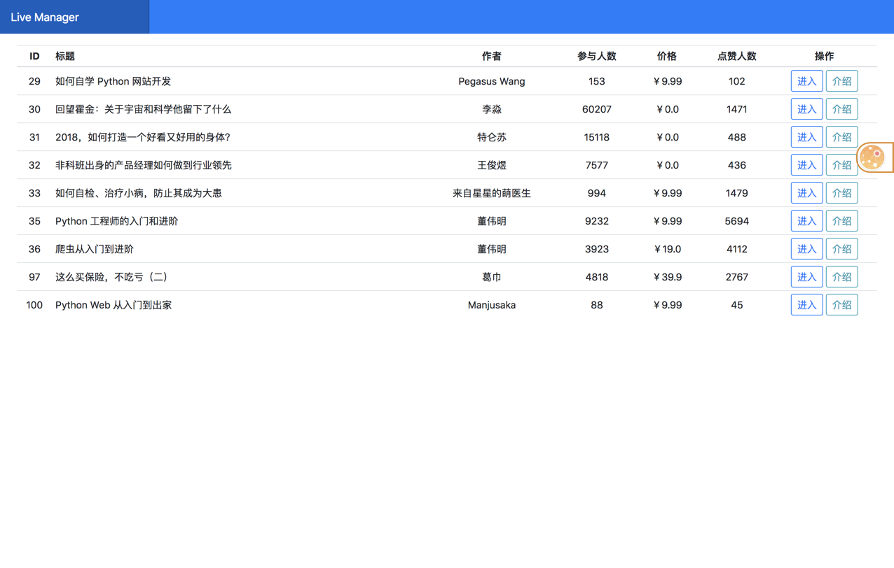
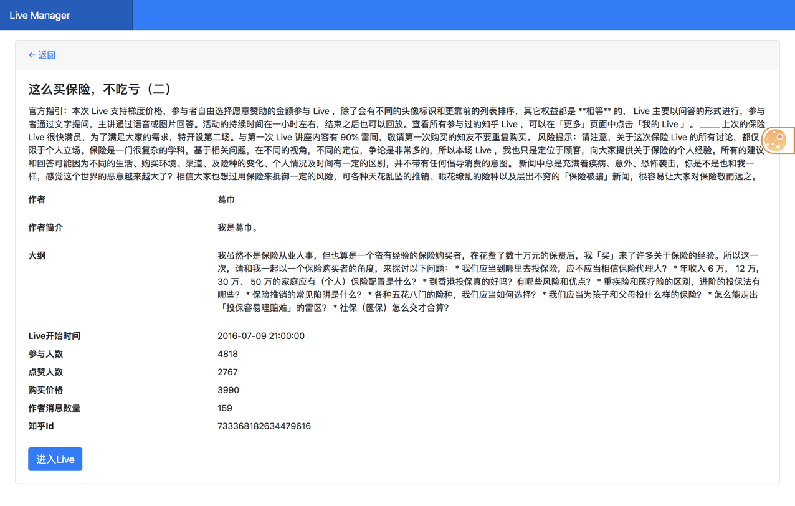
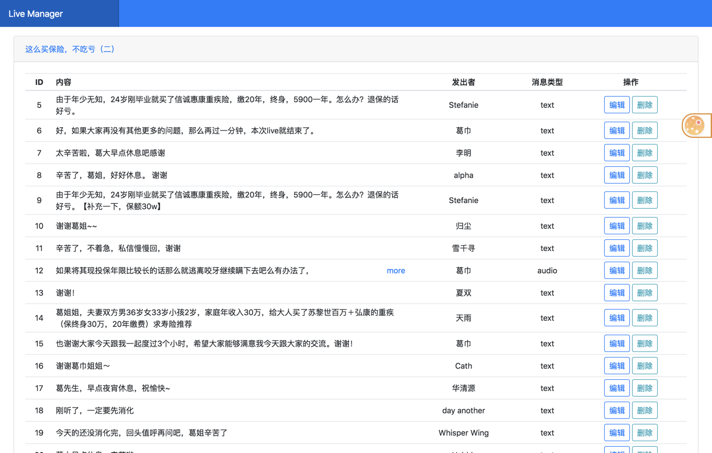
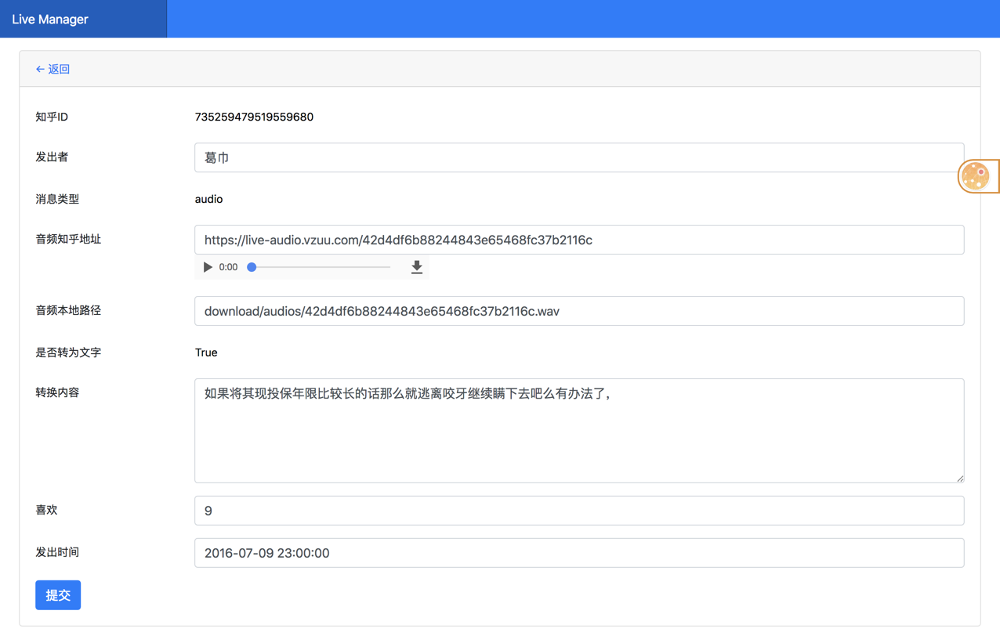

# 知乎Live内容管理器


## 简介
这是一个管理你购买过的知乎LIVE的工具，使用场景是往往我们听过的live是语音格式，无法保存、沉淀和搜索。知乎live本身做为一个付费内容，它的内容价值较高，所以做这样的工具能帮助自己更好的管理知识。希望您能注重版权，切勿随意分享自己购买过的live。

## 预览






## 安装和使用

### 使用技术
* 使用async做网络请求的处理，包括抓取知乎的live内容、将live中的音频提交至其他平台做文字转化、Web服务器。
* 使用百度提供的[API](http://yuyin.baidu.com/)进行语音文字之间的转换(经过实验对比，百度的转化效果最好)。
* 需要安装[ffmpeg组件](https://www.ffmpeg.org/),因为知乎的音频格式为aac，而百度需要其他格式。

### 安装及使用
1、创建MYSQL数据库，需要数据库字符集为utf8mb4，否则emoji表情字符串导致无法插入数据
```sql
ALTER DATABASE zhihu CHARACTER SET = utf8mb4 COLLATE = utf8mb4_unicode_ci;
ALTER TABLE message CONVERT TO CHARACTER SET utf8mb4 COLLATE utf8mb4_unicode_ci;
ALTER TABLE live CONVERT TO CHARACTER SET utf8mb4 COLLATE utf8mb4_unicode_ci;
```
2、安装pipenv
```bash
# 注意python版本要 3.5.3+, 最好要选择3.6+
pip install pipenv
```
3、安装依赖，并修改config.py内的相关数据库配置
```bash
# 不推荐使用 pipenv
pipenv install
# 推荐使用 pip install -r requirements.txt -i http://pypi.douban.com/simple/
```
4、建表
```bash
pipenv shell
python run.py initdb
```
5、爬取(命令行内输入知乎用户名密码)
```bash
python run.py crawl
```
5.1、爬取VIP LIVE 全部(需要先输入账号密码, 且在vip有效内)
```bash
# 下载的文件为 live_all.txt
# 默认排除下载的文件为 big_live.txt (默认规则大于500消息), 如果要下载, 清空文件即可(不是删除)
# 注意, problem.txt 为部分live有谜之bug, 部分数据无法抓取, 所以如果断点下载这部分会出错
# 建议, 先不下载 (可以复制problem中内容到big_live中)
# 在i5平台, 8G内存, 100M带宽下, 一次全部下载大概8小时, 全程占用50m带宽, 最后acc+img 文件80G左右
python run.py crawlvip
```
6、转化
```bash
# 未安装 ffmpeg套件, 需要先转换 文件
python run.py transform
```
7、启动管理后台
```bash
python run.py webserver
```
8、清理数据
```bash
# 调整主讲人回复到问题后面, 运行后可以解决回复多次展示的问题
python run.py clean_data
```

9、支持docker
```bash
docker run -it -d --name zhihu -p 8080:8080 -p -p 8000:8000 -v $(pwd):/app:ro xingdao/zhihu
# 注意 运行目录为项目根目录, 需要修改 config 内配置如:
    mysql \
    LOCAL_AUDIO_BASE_URL, LOCAL_IMG_BASE_URL,
    LOCAL_FILE_BASE_URL, LOCAL_VIDEO_BASE_URL
  挂载为只读挂载, 建议本地下载好数据后 再启动, 防止docker中误差作, 需要在dockers中修改数据的(运行下载等)请去除 'ro'标识

# 或者使用 项目中 Dockerfile 自行编译运行
```

### 备注
* [之前版本](https://github.com/hjlarry/zhihulive/tree/second_version)使用不同技术栈开发
* 欢迎提PR
