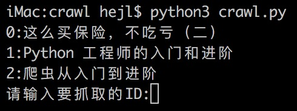
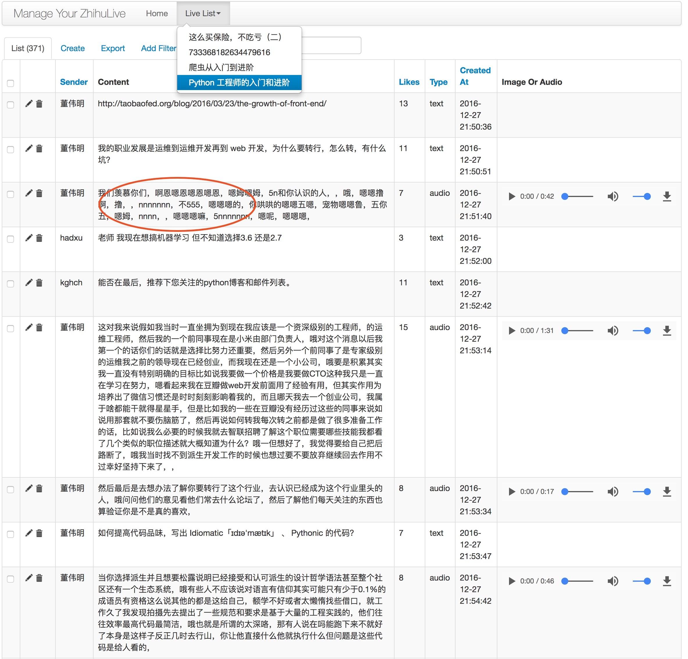
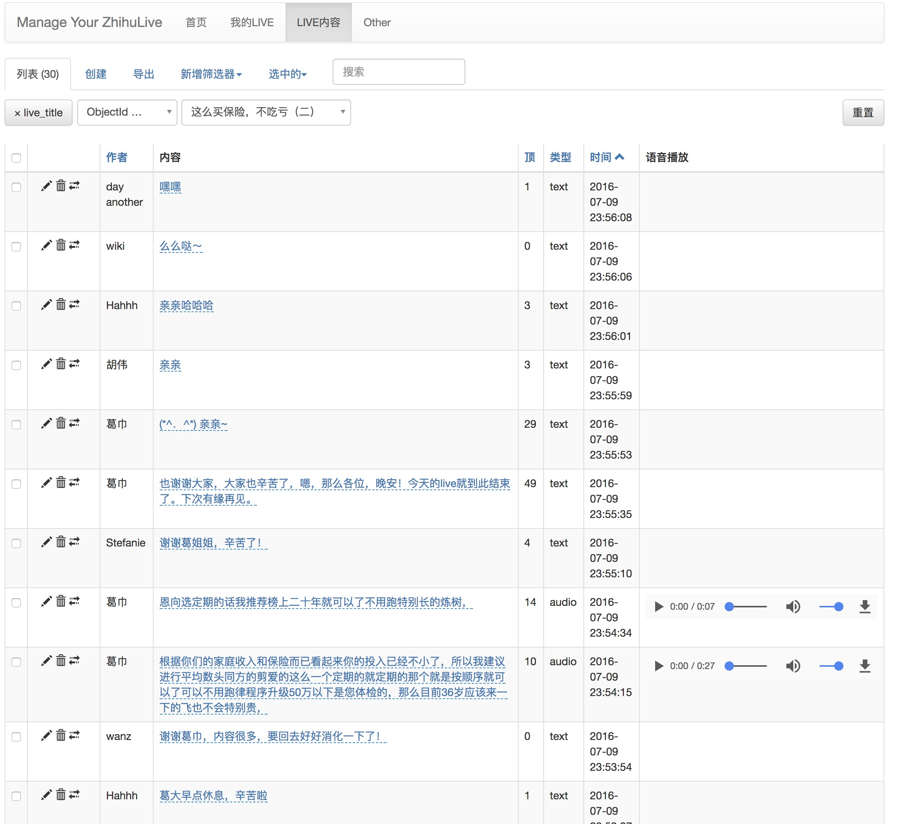

# Manage Your Zhihu Live


## 介绍
这是一个管理你购买过的知乎LIVE的工具，使用场景是往往我们听过的live是语音格式，无法保存、沉淀和搜索。知乎live本身做为一个付费内容，它的内容价值较高，所以做这样的工具能帮助自己更好的管理知识。希望您能注重版权，切勿随意分享自己购买过的live。

## 安装及依赖
项目使用[zhihu-oauth](https://github.com/7sDream/zhihu-oauth)解决登录抓取知乎live详细内容，使用mongo存储，使用百度语音识别将音频内容转换为文字，使用celery队列（redis做broker）处理大量的IO交互过程。

## 使用

### 先使用知乎账号登录
```
python3 run.py runserver
```

如果需要验证码的话，可以在根目录查看a.gif，然后在命令行中输入即可

### 抓取当前用户所购的live


### 抓取每个live的具体内容，音频转换文字

每个live前面对应的按钮分别是修改、删除、抓取、转换。请先抓取后再运行绑定。
由于百度语音需要的音频格式不同，您需要安装相关[ffmpeg组件](https://www.ffmpeg.org/)，并最好申请自己的[百度API](http://yuyin.baidu.com/)修改于config.py文件中

### 查看管理具体的live内容



